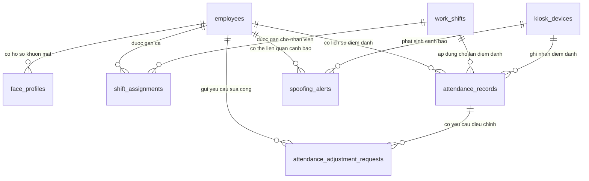

# Supabase Schema Relationships

Tai lieu nay mo ta cac bang trong schema `public` cho he thong diem danh bang nhan dien guong mat.

## So Do Quan He

## Bang Chinh

### `employees`

Luu ho so nhan vien.

Cot quan trong:

- `id`: khoa chinh UUID.
- `employee_code`: ma nhan vien, duy nhat.
- `full_name`: ho ten nhan vien.
- `department`: phong ban.
- `role_title`: vai tro/chuc danh.
- `employment_status`: trang thai lam viec, vi du `active`, `probation`, `inactive`.

Quan he:

- Mot nhan vien co nhieu `face_profiles`.
- Mot nhan vien co nhieu `attendance_records`.
- Mot nhan vien co nhieu `shift_assignments`.
- Mot nhan vien co the co nhieu `attendance_adjustment_requests`.
- Mot nhan vien co the lien quan den nhieu `spoofing_alerts`.

### `face_profiles`

Luu thong tin khuon mat da dang ky cua nhan vien.

Cot quan trong:

- `id`: khoa chinh UUID.
- `employee_id`: khoa ngoai den `employees.id`.
- `embedding`: vector 128 chieu tu model `conv-facenet`.
- `image_path`: duong dan anh dang ky trong storage.
- `status`: trang thai ho so khuon mat, vi du `active`, `revoked`, `needs_update`.
- `registered_at`: thoi diem dang ky.
- `registered_by`: nguoi thuc hien dang ky, de gan voi tai khoan admin sau nay.

Quan he:

- Nhieu `face_profiles` thuoc ve mot `employees`.
- Khi xoa nhan vien, cac `face_profiles` cua nhan vien do cung bi xoa theo `on delete cascade`.

### `work_shifts`

Luu cau hinh ca lam.

Cot quan trong:

- `id`: khoa chinh UUID.
- `name`: ten ca, vi du `Hanh chinh`, `Ca sang`, `Ca chieu`.
- `start_time`: gio bat dau ca.
- `end_time`: gio ket thuc ca.
- `late_after_minutes`: so phut cho phep truoc khi tinh di muon.
- `early_before_minutes`: so phut truoc gio ket thuc se tinh ve som.

Quan he:

- Mot ca lam co nhieu `shift_assignments`.
- Mot ca lam co the duoc gan vao nhieu `attendance_records`.

### `shift_assignments`

Gan nhan vien voi ca lam theo moc hieu luc.

Cot quan trong:

- `id`: khoa chinh UUID.
- `employee_id`: khoa ngoai den `employees.id`.
- `shift_id`: khoa ngoai den `work_shifts.id`.
- `effective_from`: ngay bat dau ap dung ca.
- `effective_to`: ngay ket thuc ap dung ca, co the rong neu van con hieu luc.

Rang buoc:

- `unique(employee_id, shift_id, effective_from)`: tranh gan trung cung mot ca cho cung nhan vien trong cung ngay bat dau.

Quan he:

- Nhieu `shift_assignments` thuoc ve mot `employees`.
- Nhieu `shift_assignments` tham chieu mot `work_shifts`.

### `kiosk_devices`

Luu danh sach kiosk/camera dung de diem danh.

Cot quan trong:

- `id`: khoa chinh UUID.
- `name`: ten thiet bi, vi du `Kiosk Cong A`.
- `camera_code`: ma camera, duy nhat.
- `location`: vi tri lap dat.
- `status`: trang thai thiet bi, vi du `online`, `offline`, `maintenance`.
- `last_seen_at`: thoi diem thiet bi gui tin hieu gan nhat.

Quan he:

- Mot kiosk co nhieu `attendance_records`.
- Mot kiosk co the tao nhieu `spoofing_alerts`.

### `attendance_records`

Luu tung ban ghi diem danh cua nhan vien.

Cot quan trong:

- `id`: khoa chinh UUID.
- `employee_id`: khoa ngoai den `employees.id`.
- `device_id`: kiosk/camera ghi nhan diem danh.
- `shift_id`: ca lam ap dung tai thoi diem diem danh.
- `attendance_date`: ngay cong.
- `check_in_at`: thoi diem vao.
- `check_out_at`: thoi diem ra.
- `status`: trang thai, vi du `valid`, `late`, `early_leave`, `missing_checkout`, `manual_adjusted`.
- `liveness_score`: diem liveness neu co.
- `match_distance`: khoang cach so khop khuon mat tu model.
- `evidence_path`: anh bang chung trong storage neu can.

Quan he:

- Nhieu `attendance_records` thuoc ve mot `employees`.
- Nhieu `attendance_records` duoc ghi nhan boi mot `kiosk_devices`.
- Nhieu `attendance_records` co the tham chieu mot `work_shifts`.
- Mot `attendance_records` co the co nhieu `attendance_adjustment_requests`.

Chi muc:

- `idx_attendance_employee_date`: tang toc truy van lich su theo nhan vien va ngay.
- `idx_attendance_date_status`: tang toc bao cao theo ngay va trang thai.

### `attendance_adjustment_requests`

Luu yeu cau chinh sua cong, vi du quen check-out, camera loi, di cong tac.

Cot quan trong:

- `id`: khoa chinh UUID.
- `attendance_id`: ban ghi diem danh can dieu chinh, co the rong neu yeu cau tao moi cong.
- `employee_id`: nhan vien gui/duoc tao yeu cau.
- `reason`: ly do dieu chinh.
- `requested_check_in_at`: gio vao de nghi.
- `requested_check_out_at`: gio ra de nghi.
- `status`: trang thai, vi du `pending`, `approved`, `rejected`.
- `reviewed_by`: nguoi duyet.
- `reviewed_at`: thoi diem duyet.

Quan he:

- Nhieu yeu cau thuoc ve mot `employees`.
- Nhieu yeu cau co the lien quan mot `attendance_records`.

### `spoofing_alerts`

Luu canh bao gia mao khi diem danh bang khuon mat.

Cot quan trong:

- `id`: khoa chinh UUID.
- `device_id`: kiosk/camera phat sinh canh bao.
- `employee_id`: nhan vien lien quan neu he thong du doan duoc.
- `alert_type`: loai canh bao, vi du `photo_replay`, `phone_screen`, `abnormal_light`.
- `risk_level`: muc rui ro, vi du `low`, `medium`, `high`.
- `evidence_path`: anh bang chung trong storage.
- `status`: trang thai xu ly, vi du `open`, `reviewed`, `dismissed`.
- `created_at`: thoi diem phat sinh.

Quan he:

- Nhieu `spoofing_alerts` co the thuoc ve mot `kiosk_devices`.
- Nhieu `spoofing_alerts` co the lien quan mot `employees`.

Chi muc:

- `idx_spoofing_alerts_status`: tang toc man hinh danh sach canh bao can xu ly.

### `audit_logs`

Luu nhat ky thao tac quan trong trong he thong.

Cot quan trong:

- `id`: khoa chinh UUID.
- `actor_id`: nguoi thuc hien thao tac, se lien ket voi bang nguoi dung/admin sau nay.
- `action`: hanh dong, vi du `approve_attendance_adjustment`, `update_shift_rule`.
- `target_table`: bang bi tac dong.
- `target_id`: id ban ghi bi tac dong.
- `before_data`: du lieu truoc khi thay doi.
- `after_data`: du lieu sau khi thay doi.
- `created_at`: thoi diem thao tac.

Ghi chu:

- Bang nay hien chua co khoa ngoai vi he thong admin/auth se duoc thiet ke sau.
- Khi them Supabase Auth hoac bang `admin_users`, co the lien ket `actor_id` den bang nguoi dung quan tri.

## Luong Du Lieu Chinh

### Dang Ky Khuon Mat

1. Tao ho so trong `employees`.
2. Backend goi `conv-facenet` de tao embedding 128 chieu.
3. Luu embedding vao `face_profiles.embedding`.
4. Neu co anh goc, luu anh vao Supabase Storage va ghi duong dan vao `face_profiles.image_path`.

### Diem Danh Kiosk

1. Kiosk gui anh len backend.
2. Backend kiem tra liveness va trich xuat embedding.
3. Backend so khop voi `face_profiles.embedding`.
4. Neu hop le, tao/cap nhat `attendance_records`.
5. Neu nghi van gia mao, tao ban ghi `spoofing_alerts`.

### Duyet Chinh Sua Cong

1. Tao yeu cau trong `attendance_adjustment_requests`.
2. Admin duyet hoac tu choi.
3. Neu duyet, cap nhat `attendance_records`.
4. Ghi thao tac vao `audit_logs`.

## Ghi Chu Ve RLS

Tat ca bang da bat Row Level Security. Khi backend dung `service_role` key, backend co the doc/ghi theo logic rieng. Khi frontend truy cap truc tiep Supabase bang anon key, can tao policy rieng truoc khi cho phep doc/ghi.
