# Conv-FaceNet
- Sử dụng ConvNeXt làm mô hình cơ sở (base model) cho nhận diện khuôn mặt với PyTorch.
- Mô hình được huấn luyện trên tập dữ liệu CelebFaces quy mô lớn với hơn 200.000 hình ảnh của người nổi tiếng.
- Độ chính xác của mô hình trên tập dữ liệu CelebA đạt khoảng 93.6% và trên tập Labeled Faces in the Wild (LFW) đạt 95.8%.
- Tất cả mã nguồn của mô hình phục vụ cho việc sử dụng trực tiếp nằm tại thư mục [src/convfacenet](src/convfacenet).

# Hướng dẫn sử dụng mô hình trực tiếp
- Bạn có thể cài đặt mô hình này vào dự án của mình và sử dụng trực tiếp bộ phát hiện (detector) + bộ trích xuất đặc trưng (descriptor) để thực hiện trích xuất vector đặc trưng, đối khớp khuôn mặt và phát hiện/cắt ảnh khuôn mặt.

- Cài đặt thông qua git:
  `pip install git+https://github.com/ahmedbadr97/conv-facenet`
  
```python
import convfacenet

# Bạn có thể trích xuất các đặc trưng khuôn mặt từ một bức ảnh
img = convfacenet.load_image(img_path)
faces_feature_list = convfacenet.faces_features(img)

# ___ Cắt và căn chỉnh khuôn mặt từ ảnh gốc ___
faces_imgs = convfacenet.detect_face(img)
# Bạn có thể chỉ định kích thước ảnh khuôn mặt đầu ra (ví dụ 240x240)
faces_imgs = convfacenet.detect_face(img, target_size=(240, 240))

# ___ So khớp hai khuôn mặt xem có cùng một người hay không ___
img1 = convfacenet.load_image(img1_path)
img2 = convfacenet.load_image(img2_path)

boolean_result, prediction_value = convfacenet.verify_faces(img1, img2)
# Chỉ định ngưỡng (threshold) --> tốt nhất là 0.4
boolean_result, prediction_value = convfacenet.verify_faces(img1, img2, threshold=0.45)
```

# Tập dữ liệu (Dataset)
## [Tập dữ liệu CelebFaces Attributes (CelebA)](https://mmlab.ie.cuhk.edu.hk/projects/CelebA.html) 
<p align="center"> </p>  

- CelebFaces Attributes (CelebA) là một tập dữ liệu thuộc tính khuôn mặt quy mô lớn với hơn 200.000 hình ảnh của người nổi tiếng.
- Các hình ảnh trong tập dữ liệu này bao gồm sự đa dạng rất lớn về góc chụp (pose), biểu cảm khuôn mặt và bối cảnh nền phức tạp. Các đặc điểm chính:
  - 10.177 định danh (danh tính khác nhau)
  - 202.599 hình ảnh khuôn mặt
  - Dung lượng tập dữ liệu khoảng 10 GB
- Cấu trúc thư mục dữ liệu trước khi chuẩn bị:
  - `dataset/img-celba/xxxxxx.jpg`: thư mục chứa hình ảnh.
  - `dataset/identites.txt`: file văn bản, mỗi dòng chứa thông tin `tên-ảnh số-định-danh`. 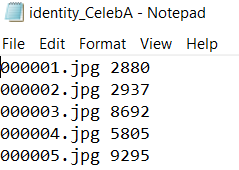
- ### Hình ảnh mẫu (Sample images)
  - 

# Tiền xử lý và chuẩn bị dữ liệu
- [Xem Jupyter Notebook Tiền xử lý dữ liệu](notebooks/data_preprocessing.ipynb)
- Sử dụng bộ phát hiện khuôn mặt [face-detection](https://github.com/elliottzheng/face-detection) của tác giả [elliottzheng](https://github.com/elliottzheng) để phát hiện khuôn mặt.
- Căn chỉnh khuôn mặt (face alignment) để cải thiện hiệu năng học của mô hình: xác định tọa độ mắt trái và mắt phải, sau đó xoay ảnh để hai mắt nằm trên cùng một đường thẳng nằm ngang và căn khuôn mặt vào trung tâm ảnh.
- Thay đổi kích thước ảnh (resize) sau khi trích xuất và căn chỉnh thành ảnh vuông kích thước 240x240 (kích thước đầu vào của mô hình) mà không làm biến dạng khuôn mặt: thêm các điểm ảnh màu đen vào phần rìa để tạo thành ảnh vuông trước khi tiến hành resize.
- Sau khi thực hiện cắt khuôn mặt và thay đổi kích thước, dung lượng tập dữ liệu giảm từ 10 GB xuống còn khoảng 2.82 GB, giúp tăng đáng kể tốc độ huấn luyện.
## Minh họa
<p align="center">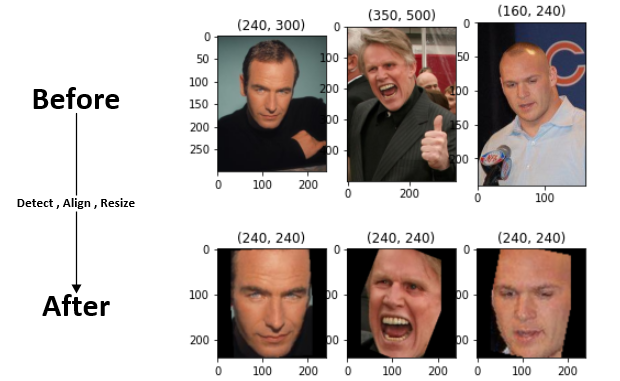 </p>  

## Chuẩn bị dữ liệu huấn luyện (train) và kiểm thử (test)
1. Đọc file txt chứa liên kết tên hình ảnh/định danh (mỗi dòng chứa tên ảnh và mã định danh của ảnh đó).
2. Tạo từ điển (dictionary) chứa danh sách ảnh theo định danh: `{"mã-định-danh": [danh sách tên ảnh]}`.
3. Chia ngẫu nhiên danh sách định danh thành hai tập train và test.
4. Tạo các thư mục `train` và `test`.
5. Với mỗi định danh, tạo một thư mục con riêng biệt và lưu các ảnh thuộc định danh đó vào trong: `person_id/tên_ảnh.jpg`.
- Cấu trúc thư mục dữ liệu sau khi chuẩn bị:
  - `train/person_id/xxxxxx.jpg`
  - `test/person_id/xxxxxx.jpg`
## Thông tin thống kê (Metadata)
  ```text
Số lượng định danh huấn luyện (train) = 7632
Số lượng ảnh huấn luyện (train) = 147944
Số lượng ảnh trung bình trên mỗi định danh = 19

Số lượng định danh kiểm thử (test) = 2545
Số lượng ảnh kiểm thử (test) = 48969
Số lượng ảnh trung bình trên mỗi định danh = 19
  ```

# Quá trình Huấn luyện và Tải dữ liệu (Data Loading)
- Trong phần này tôi sẽ trình bày:
  - Cách huấn luyện mô hình để đạt được độ chính xác cao và thời gian huấn luyện.
  - Phương pháp chọn mẫu âm ngẫu nhiên (random negative selection) và chọn mẫu âm khó (hard negative selection) hiệu quả.
  - Lịch sử huấn luyện và việc lựa chọn mô hình xương sống (backbone) để bắt đầu quá trình học chuyển giao (transfer learning).

## Mục tiêu huấn luyện:
  - Chúng ta muốn mô hình tối thiểu hóa khoảng cách giữa các vector đặc trưng của cùng một người (`anchor` và `anchor-positive`) và tối đa hóa khoảng cách giữa các vector đặc trưng của hai người khác nhau (`anchor` và `anchor-negative`).
  - 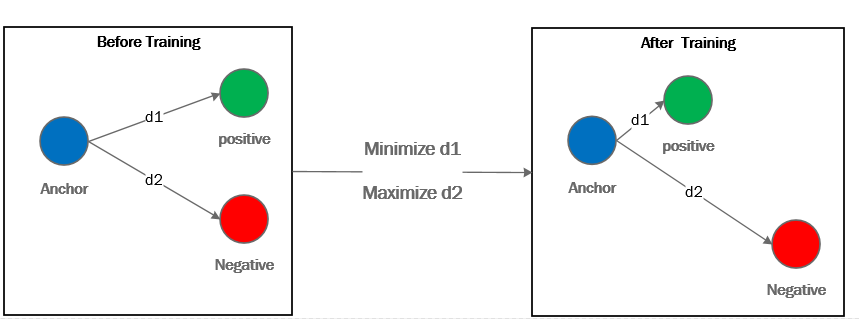
  - Đầu ra đặc trưng của khuôn mặt là một vector có số chiều là 128.
  

## Thuật toán huấn luyện
- Đầu tiên, chọn một người (a) ngẫu nhiên từ tập các định danh huấn luyện, sau đó chọn hai bức ảnh khác nhau của người này: `người(a)_ảnh1` (anchor) và `người(a)_ảnh2` (anchor-positive).
- Chọn một người (b) khác với người (a), sau đó chọn một bức ảnh của người (b): `người(b)_ảnh1` (anchor-negative).
- Thực hiện ba lượt lan truyền xuôi (forward pass) qua mô hình cho mỗi bức ảnh, thu được 3 vector đặc trưng 128 chiều: `người(a)_ảnh1 (vector 128 chiều)`, `người(a)_ảnh2 (vector 128 chiều)` và `người(b)_ảnh1 (vector 128 chiều)`.
- Mục tiêu là thu hẹp khoảng cách giữa `người(a)_ảnh1` và `người(a)_ảnh2` (cùng một người), đồng thời đẩy xa khoảng cách giữa `người(a)_ảnh1` và `người(b)_ảnh1`.
- Tính hàm mất mát **Triplet Margin Loss** cho ba vector đặc trưng này, sau đó thực hiện lan truyền ngược (backward pass) và cập nhật trọng số của mô hình.
### Hàm mất mát (Loss function)
- Sử dụng hàm mất mát **Triplet Margin Loss**:
- 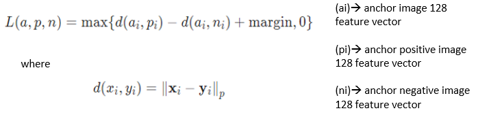

### Lựa chọn mẫu âm (Anchor Negative Selection)
- Ban đầu mô hình được huấn luyện với phương pháp **Lựa chọn mẫu âm ngẫu nhiên (Random Anchor Negative Selection)**. Sau khi sai số (train_loss, test_loss) giảm xuống ổn định, thuật toán sẽ chuyển sang phương pháp **Lựa chọn mẫu âm khó (Hard Anchor Negative Selection)**.

#### Lựa chọn mẫu âm ngẫu nhiên (Random Anchor Negative Selection)
- Chọn ngẫu nhiên người (a) từ tập huấn luyện và chọn hai bức ảnh ngẫu nhiên của người này.
- Chọn ngẫu nhiên người (b) (khác người a) và một ảnh ngẫu nhiên của người đó làm mẫu âm.
- Lớp tải dữ liệu thực thi: `FacesTripletDataset` trong file [data_load.py](src/convfacenet_train/data_load.py).

#### Lựa chọn mẫu âm khó (Hard Anchor Negative Selection)
- Trước khi bắt đầu huấn luyện epoch mới, trích xuất tất cả đặc trưng của các ảnh bằng trọng số checkpoint mới nhất của mô hình và lưu vào từ điển: `img_features_dict` (key: `đường_dẫn_ảnh_đầy_đủ`, value: `vector_đặc_trưng_128_chiều`).
- Các ảnh được sử dụng làm **mẫu âm khó (anchor negative)** sẽ được cập nhật lại đặc trưng sau mỗi epoch.
- Với mỗi bước huấn luyện cho bộ ba ảnh (anchor, anchor_positive, anchor_negative):
  1. Chọn ngẫu nhiên người (a) và hai bức ảnh của người (a).
  2. Chọn ngẫu nhiên `n` ảnh của các người khác (với `n` được định nghĩa trong bộ tải dữ liệu).
  3. Từ `n` ảnh này, tìm đường dẫn ảnh có khoảng cách Euclidean nhỏ nhất so với ảnh anchor (tức là người khác nhưng có gương mặt giống người (a) nhất).
  4. Thêm đường dẫn ảnh được chọn vào danh sách các ảnh sử dụng trong epoch hiện tại để cập nhật lại vector đặc trưng trong epoch tiếp theo.
- Sau mỗi epoch, cập nhật lại toàn bộ `img_features_dict` sử dụng trọng số mới nhất vừa được tối ưu.

## Các bộ tải dữ liệu (Train Data Loaders)
- Đường dẫn file: [data_load.py](src/convfacenet_train/data_load.py)
- Lớp `FacesDataset`
  - Lớp cha cho bộ tải dữ liệu khuôn mặt, chịu trách nhiệm tải tất cả các định danh và danh sách đường dẫn ảnh tương ứng.
  - Lớp nhận vào đường dẫn tập dữ liệu, số lượng dòng cho mỗi epoch và các phép biến đổi ảnh (transforms) cần áp dụng.
  - Tính toán số liệu thống kê việc sử dụng ảnh (số lần sử dụng của mỗi ảnh, số lần sử dụng trung bình và độ lệch chuẩn) để đảm bảo mô hình được huấn luyện đều trên tất cả các ảnh và thuật toán chọn ngẫu nhiên tuân theo phân phối đều.
  - Sử dụng **Lựa chọn mẫu âm ngẫu nhiên (Random anchor negative selection)**.
- Lớp `FaceHardSelectionDataset`
  - Kế thừa từ `FacesDataset`.
  - Tải trước tất cả vector đặc trưng khuôn mặt của tập dữ liệu vào một từ điển (sử dụng batch loading để tăng tốc độ tải đặc trưng).
    - Cấu trúc dictionary key: `person_identity/pic_name.jpg` -> value: `[vector đặc trưng 128 chiều]`.
  - Sử dụng **Lựa chọn mẫu âm khó (Hard anchor negative selection)**.

## Vòng lặp huấn luyện (Training Loop)
- Đường dẫn file: [models_train.py](src/convfacenet_train/models_train.py)
- Lưu nhật ký train loss và test loss trong suốt quá trình huấn luyện.
- Lưu lại trọng số của mô hình sau mỗi epoch nếu giá trị test loss đạt mức tối thiểu mới.
- Tính toán thời gian huấn luyện trung bình còn lại (time remaining) và thời gian đã thực hiện (time taken).
- In cảnh báo nếu phát hiện hiện tượng quá khớp (overfitting).
- Lưu lại lịch sử huấn luyện dưới dạng file Excel theo đường dẫn được cung cấp.
  - 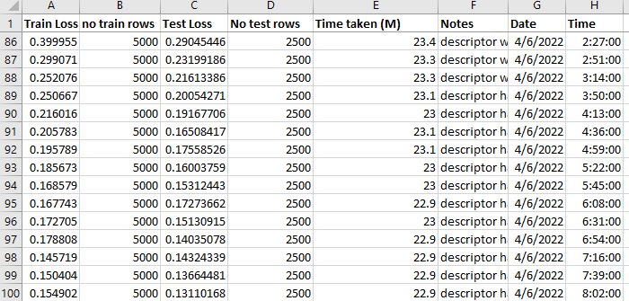
### Huấn luyện với mẫu âm khó (Hard negative training)
  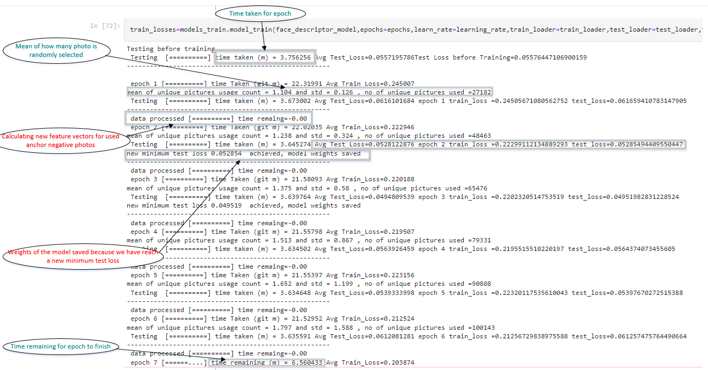

# Lịch sử huấn luyện và Lựa chọn mô hình cho Backend
- Tất cả lịch sử huấn luyện từ ngày 15/05/2022 được lưu trữ trong tệp CSV, bao gồm việc thử nghiệm các thuật toán khác nhau, thay đổi cấu trúc bộ phân lớp (classifier), chuẩn hóa đầu vào, thay đổi tốc độ học (learning rate), và phương pháp tải dữ liệu.
## Mô hình EfficientNet
- Ban đầu tôi thử nghiệm với mô hình EfficientNet-B1 trên một phần nhỏ của tập dữ liệu CelebA (khoảng 25.000 ảnh) để đánh giá và chọn ra cấu trúc tốt nhất cho mạng kết nối đầy đủ (fully connected classifier).
### Huấn luyện trên tập dữ liệu con (small subset)
- Huấn luyện 131 epoch từ ngày 16/05/2022 đến ngày 25/05/2022.
- 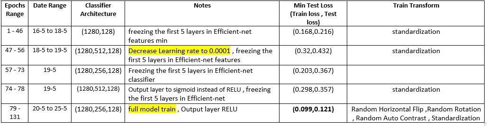
- 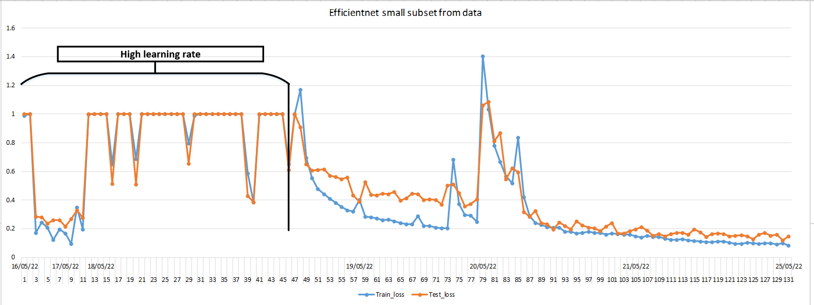

### Huấn luyện trên toàn bộ tập dữ liệu (full dataset)
- Cấu trúc mạng phân lớp sử dụng: (1280, 256, 128)
- Các phép biến đổi dữ liệu huấn luyện (transforms): Random Horizontal Flip, Random Rotation, Random Auto Contrast, và chuẩn hóa (standardization).
- Huấn luyện 230 epoch từ ngày 26/05/2022 đến ngày 03/06/2022.
- 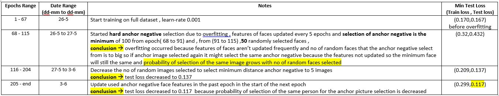
- 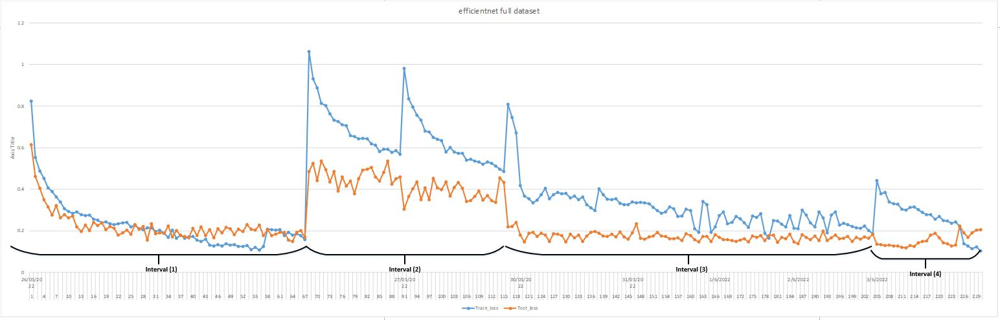

## Mô hình ConvNeXt
- Cấu trúc mạng phân lớp sử dụng: (768, 128)
- 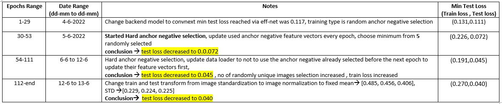
- 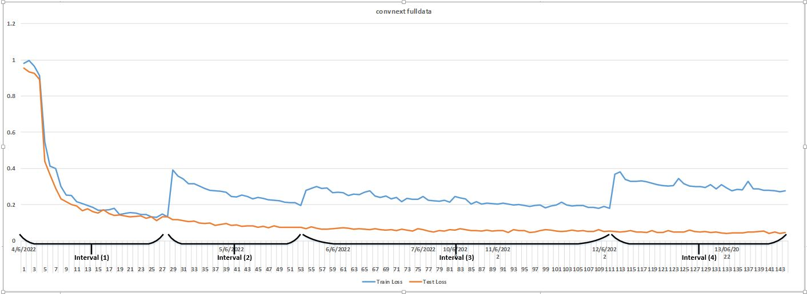

# Đánh giá mô hình (Model Evaluation)
## Tập dữ liệu CelebA
- 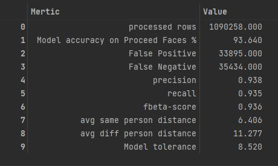

## Tập dữ liệu Labeled Faces in the Wild (LFW)
- 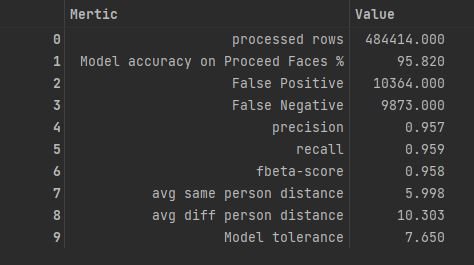
